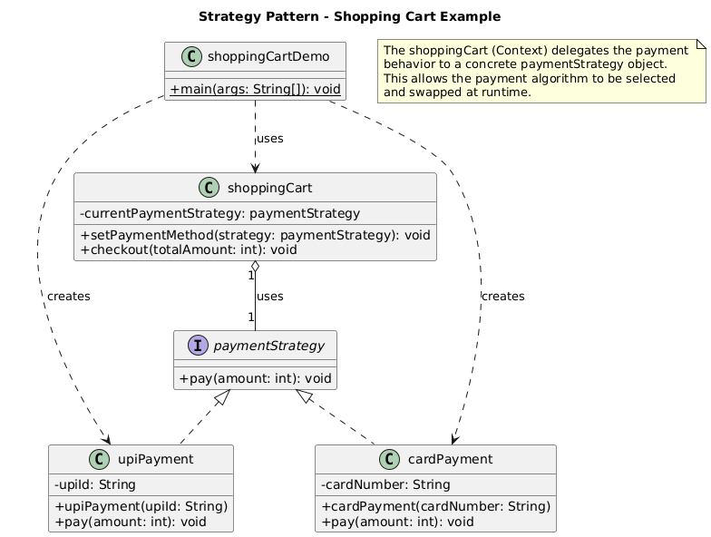

# Java Design Patterns Showcase

This project is a practical collection of classic software design patterns implemented in Java. Each pattern is demonstrated within a distinct, real-world example to illustrate its purpose, structure, and benefits. The project also includes a more complex Mars Rover simulator that combines multiple patterns.

## Features

The following design patterns are implemented and demonstrated:

* **Creational Patterns**:
    * Factory Method
    * Singleton
* **Structural Patterns**:
    * Adapter
    * Decorator
* **Behavioral Patterns**:
    * Observer
    * Strategy

This project is built on a foundation of robust and professional engineering practices to ensure reliability and performance.

* **Centralized Logging:** Uses `java.util.logging` for detailed runtime tracing and error diagnostics.
* **Robust Exception Handling:** Implements comprehensive `try-catch` blocks, input validation, and defensive checks to ensure graceful error handling and prevent crashes.
* **Performance Optimised:** Employs efficient data structures (e.g., `HashSet` for O(1) obstacle lookups) and clean algorithms to ensure responsive execution.

## Project Structure

The project is organized into packages based on the type and purpose of the design patterns:

* `creational.*`: Contains creational design patterns.
    * `factory`: Vehicle manufacturing example.
    * `singleton`: Global configuration manager example.
* `structural.*`: Contains structural design patterns.
    * `adapter`: Media player compatibility example.
    * `decorator`: Coffee ordering example.
* `behavioral.*`: Contains behavioral design patterns.
    * `observer`: Stock market updates example.
    * `strategy`: Shopping cart payment example.
* `task2.*`: A standalone Mars Rover simulator demonstrating the Command and Composite patterns.

## Code Quality & Engineering

* **Centralized Logging:** Uses `java.util.logging` for detailed runtime tracing and error diagnostics.
* **Robust Exception Handling:** Implements comprehensive `try-catch` blocks, input validation, and defensive checks to ensure graceful error handling and prevent crashes.
* **Performance Optimised:** Employs efficient data structures (e.g., `HashSet` for O(1) lookups).

## Behavioral Patterns

### 1. Observer Pattern

**Purpose:** Defines a one-to-many dependency between objects. When one object (the subject) changes its state, all its dependents (observers) are notified and updated automatically.

**Implementation:** A `stockMarket` (Subject) maintains a list of `stockTrader` (Observers). When the stock price changes via `setStockInfo()`, the `stockMarket` notifies all registered traders by calling their `update()` method.

**Features:**
* Loose coupling between the Subject and Observers.
* Supports broadcast communication.
* Allows for dynamic addition and removal of observers.

**Observer Pattern UML Diagram:**


### 2. Strategy Pattern

**Purpose:** Defines a family of algorithms, encapsulates each one, and makes them interchangeable. This lets the algorithm vary independently from the clients that use it.

**Implementation:** A `shoppingCart` allows the user to pay using different methods. The payment logic is encapsulated in objects that implement the `paymentStrategy` interface (e.g., `cardPayment`, `upiPayment`). The cart's `checkout` method delegates the payment action to the currently selected strategy object.

**Features:**
* Allows for runtime selection of algorithms.
* Eliminates conditional statements for selecting behavior.
* Encapsulates different algorithms in separate classes.

**Strategy Pattern UML Diagram:**


## Creational Patterns

### 1. Factory Pattern

**Purpose:** Creates objects without exposing the instantiation logic to the client and refers to the newly created object using a common interface.

**Implementation:** A `vehicleFactory` is used to create different types of `vehicle` objects (e.g., `car`, `motorcycle`, `truck`). The client does not need to know how to construct each vehicle; it simply requests one from the factory by type.

**Features:**
* Decouples client code from concrete class instantiation.
* Centralizes object creation logic.
* Easily extensible to add new product types (e.g., a `Bus` class) without changing the client code.

**Factory Pattern UML Diagram:**


### 2. Singleton Pattern

**Purpose:** Ensures that a class has only one instance and provides a global point of access to it.

**Implementation:** The `configurationManager` class ensures that only one instance of itself is ever created. It manages application-wide settings like API keys and database connections. Any part of the application can access this single instance to get or set configuration properties.

**Features:**
* Guarantees a single instance of a class.
* Provides a global access point via the `getInstance()` method.
* Uses a private constructor to prevent external instantiation.

**UML Diagram:**


## Structural Patterns

### 1. Adapter Pattern

**Purpose:** Allows incompatible interfaces to work together. It acts as a bridge between two interfaces by converting the interface of a class into another one that a client expects.

**Implementation:** An `audioPlayer` can natively play "mp3" files. To play other formats like "vlc" or "mp4", it uses a `mediaAdapter`. The adapter implements the standard `mediaPlayer` interface but internally uses different classes (`vlcPlayer`, `mp4Player`) to handle the specific formats.

**Features:**
* Integrates existing classes with incompatible interfaces.
* Promotes code reusability.
* Separates the client from the implementation of the adapted classes.

**Adapter Pattern UML Diagram:**


### 2. Decorator Pattern

**Purpose:** Adds new functionalities to an object dynamically without altering its structure. It wraps an object to provide extended features.

**Implementation:** A `SimpleCoffee` object can be "decorated" with additional condiments like `MilkDecorator` and `SugarDecorator`. Each decorator wraps the coffee object, adds its own cost and description, and delegates the call to the wrapped object.

**Features:**
* Flexibly add or remove responsibilities from objects at runtime.
* Avoids subclassing for adding features.
* Allows for multiple combinations of decorations (e.g., coffee with milk and sugar).

**Decorator Pattern UML Diagram:**


## Task 2: Mars Rover Simulator

This task is a complete program that simulates a rover navigating a grid with obstacles. It combines multiple design patterns to create a flexible and robust solution.

### Features
* **Grid Initialization:** Set up a grid of any width and height.
* **Obstacle Placement:** Dynamically add obstacles to the grid.
* **Rover Control:** The rover can move forward (`M`), turn left (`L`), and turn right (`R`).
* **Command Processing:** A sequence of commands can be sent to the rover for execution.
* **Obstacle & Boundary Detection:** The rover stops and reports if it encounters an obstacle or a grid boundary.
* **Status Reporting:** The rover can report its final position and heading.

### Design Patterns Used

1.  **Command Pattern (Behavioral):**
    * **Purpose:** To encapsulate user commands ('M', 'L', 'R') into objects.
    * **Implementation:** The `Command` interface is implemented by `MoveCommand`, `TurnLeftCommand`, and `TurnRightCommand`. The `Main` class acts as the client, creating these command objects, while the `Rover` is the receiver that performs the actual actions. This decouples the command invoker from the action performer.

2.  **Composite Pattern (Structural):**
    * **Purpose:** To represent the grid and its contents (like obstacles) in a uniform way.
    * **Implementation:** The `Grid` can be seen as a `Composite` object that contains `Leaf` objects (`Obstacle`). This conceptual model allows treating a group of objects (the grid system) in the same way as a single object, simplifying management.

### UML Diagram for Mars Rover


**Compile and Run Command:**

Compilation:
```bash
javac -cp . -d bin MainMenu.java task-1/src/behavioral/observer/*.java task-1/src/behavioral/strategy/*.java task-1/src/creational/factory/*.java task-1/src/creational/singleton/*.java task-1/src/structural/adapter/*.java task-1/src/structural/decorator/*.java task-1/src/log/util/*.java task-2/src/task2/Main.java task-2/src/task2/commands/*.java task-2/src/task2/grid/*.java task-2/src/task2/rover/*.java

```
run command:
```bash
java -cp bin MainMenu

```
Output:
